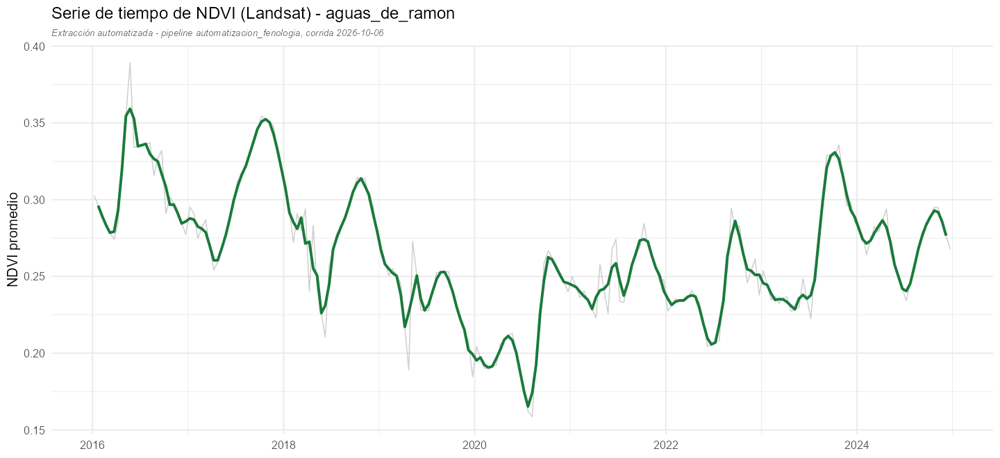

# Automatización de Análisis Fenológico con Landsat

[](https://doi.org/10.5281/zenodo.23067268)

**PhenoSeries** funciona como un monitor de signos vitales para la vegetación. Le entregas el contorno de un lugar y te devuelve su historial: qué tan verde y activa estuvo cada 15 días y cómo fue cada temporada, cuándo empezó, cuánto duró y qué tan fuerte fue. El monitor no diagnostica, solo muestra las señales. Interpretarlas sigue siendo trabajo de quien conoce el lugar.



*Ejemplo de resultado: NDVI promedio de la cuenca Aguas de Ramón con Landsat 8, de 2016 a 2024. La línea gris es el promedio de cada periodo (unos 15 días) y la verde es una media móvil de tres periodos.*

PhenoSeries es el nombre de trabajo del proyecto. El repositorio se llama `automatizacion_fenologia`.

Pipeline automatizado para caracterizar la respuesta fenológica de cualquier área de interés
(bosque, matorral, cuenca, etc.) a partir de un shapefile de entrada, usando series de tiempo
NDVI de Landsat y extracción de métricas fenológicas 100% scripteada en R (sin TIMESAT).

Basado en la metodología desarrollada en
[residencia_aguas_de_ramon](https://github.com/acoddou/residencia_aguas_de_ramon),
adaptada para correr de extremo a extremo sobre cualquier área, sin intervención manual.

## Por qué Landsat

Landsat se eligió como sensor único del pipeline por:
- **Registro histórico largo (1984-presente)**, a diferencia de Sentinel-2 (2015+ con cobertura
  completa recién desde 2019), lo que permite correr el pipeline sobre cualquier área y rango de
  fechas sin quedar limitado por disponibilidad de datos.
- **Alta correlación con Sentinel-2 en métricas de productividad acumulada** (LIN R=0.95, AMP R=0.92),
  validado en el análisis de la cuenca Aguas de Ramón.
- **Resolución intermedia (30m)** que da suficiente detalle espacial sin la carga computacional de Sentinel.

### Advertencia de uso - métricas fenológicas de fecha (SOS/EOS/PET/LOS)

La correlación entre sensores para fechas específicas de eventos fenológicos es baja o negativa
(ej. SOS entre MODIS y Landsat: R=-0.69). El pipeline calcula estas métricas igual, pero el output
las marca explícitamente como **de menor confiabilidad** frente a LIN/AMP, que sí son robustas
entre sensores.

## Estructura

```
automatizacion_fenologia/
│
├── 00_input/
│   └── area.shp                      # Único input manual: el polígono del área a analizar
│
├── 01_pipeline/
│   ├── 00_inicializar_gee.R           # Autenticación rgee/Earth Engine (correr 1 vez por sesión de R)
│   ├── 01_extraccion_landsat.R       # rgee: NDVI Landsat recortado al shp, con enmascarado de nubes
│   │                                  # (QA_PIXEL) aplicado en Earth Engine antes de extraer
│   ├── 02_limpieza_series.R          # Regularización temporal (binning por periodo) y gap-filling
│   │                                  # sobre los huecos que dejó el enmascarado de nubes
│   ├── 03_fenologia_phenofit.R       # Suavizado + extracción SOS/EOS/PET/LOS/LIN/AMP (reemplaza TIMESAT)
│   └── 06_visualizaciones.R          # Mapas y gráficos automáticos
│
├── 02_output/
│   └── <nombre_area>_<fecha_corrida>/
│       ├── <nombre_area>_landsat_ndvi_raw.csv
│       ├── <nombre_area>_landsat_ndvi_limpio.csv
│       ├── <nombre_area>_fenologia.csv
│       └── plots/
│
├── docs/img/                          # Imágenes del README
├── run_pipeline.R                    # Punto de entrada único
├── correr_mi_area.R                  # Plantilla para correr un área nueva
├── CITATION.cff
├── LICENSE
└── README.md
```

## Uso

```r
source("run_pipeline.R")

correr_pipeline(
  shp_path     = "00_input/area.shp",
  fecha_inicio = "2019-01-01",
  fecha_fin    = "2024-12-31",
  nombre_area  = "mi_area"
  # más parámetros: ver run_pipeline.R
)
```

## Requisitos

- R >= 4.2
- `rgee` (requiere cuenta de Google Earth Engine autenticada)
- `phenofit` (extracción de métricas fenológicas, reemplaza TIMESAT)
- `sf`, `terra`, `tidyverse`

## Estado

Por ahora PhenoSeries trabaja solo con Landsat 8: extracción de la serie NDVI, limpieza, métricas fenológicas por temporada y gráficos automáticos. Incorporar Sentinel-2 y MODIS está pendiente.
